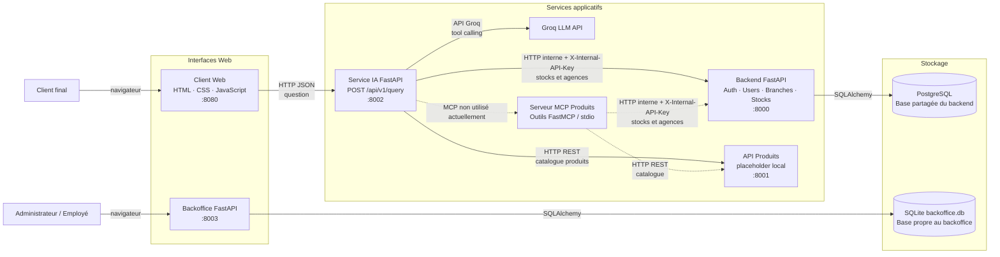

# HBntory — Architecture globale

Ce diagramme décrit l'architecture **actuellement implémentée** dans le
dépôt. Les flèches pleines représentent les appels utilisés à l'exécution ;
les flèches pointillées signalent un composant présent mais non intégré au
flux principal.

## Flux principaux

1. Le client envoie une question depuis le Client Web vers le Service IA.
2. Le Service IA demande au modèle Groq de choisir les données nécessaires.
3. Il interroge directement l'API Produits pour le catalogue et les routes
   internes du Backend pour le stock et les agences.
4. Le Backend lit et écrit dans PostgreSQL.
5. Les administrateurs et employés utilisent le Backoffice, qui gère ses
   propres utilisateurs, agences et stocks dans `backoffice.db`.

## Point d'attention d'intégration

Le Backoffice et le Backend n'utilisent pas la même base de données : le
Backoffice utilise SQLite, tandis que le Backend utilise PostgreSQL. Ainsi,
une modification effectuée dans le Backoffice n'est pas visible dans le
chatbot. De même, le serveur MCP est bien présent, mais le Service IA le
contourne actuellement en appelant directement les API HTTP.

Voir aussi [le rapport de compatibilité](COMPATIBILITY_REPORT.md) pour les
conséquences et les pistes d'intégration.
