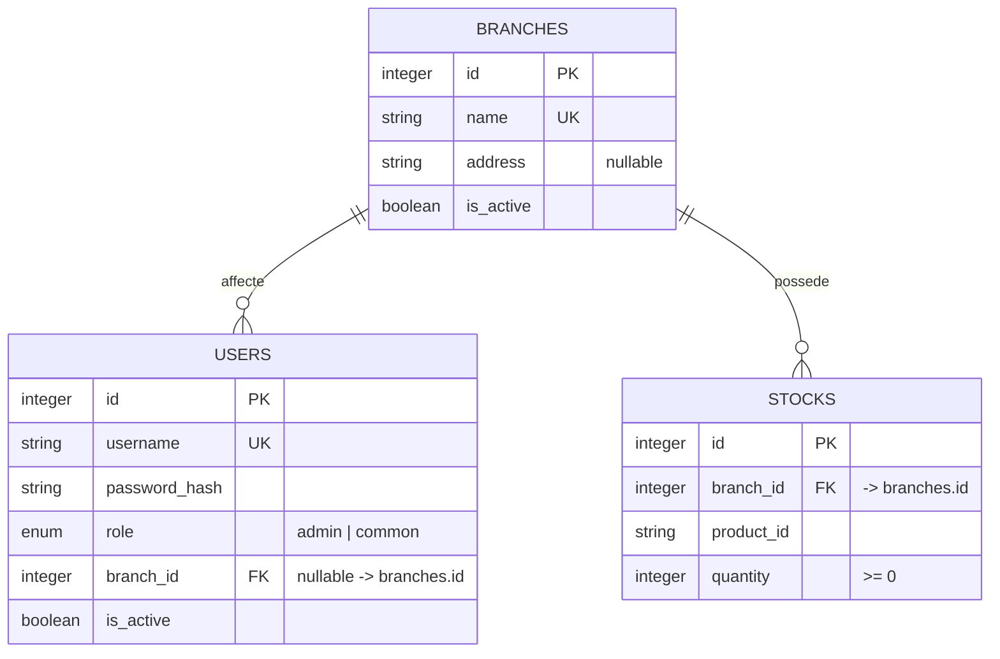
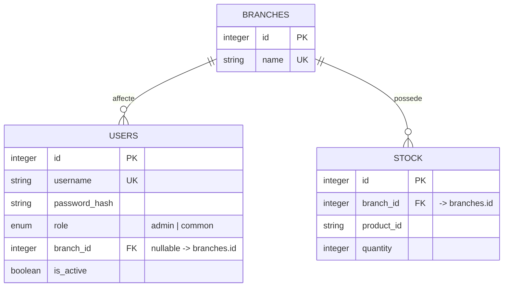

# HBntory — Diagramme de base de donnees

Le projet contient actuellement **deux bases distinctes** :

- le Backend utilise PostgreSQL ; c'est la base consultee par le service IA ;
- le Backoffice utilise son propre fichier SQLite (`backoffice.db`).

Les schemas se ressemblent, mais ils ne partagent ni les donnees ni les
contraintes. Les deux diagrammes doivent donc etre lus separement.

## Backend — PostgreSQL

Contraintes principales :

- `branches.name` et `users.username` sont uniques ;
- un stock est unique par couple `(branch_id, product_id)` ;
- `quantity` ne peut pas etre negative ;
- si une agence est supprimee, ses lignes de stock sont supprimees ;
- si une agence est supprimee, le `branch_id` des utilisateurs est remis a
  `NULL`.

## Backoffice — SQLite

## Regles metier visibles dans le schema

- Un utilisateur est rattache a zero ou une agence ; une agence peut avoir
  plusieurs utilisateurs.
- Une ligne de stock appartient a une seule agence ; une agence peut avoir
  plusieurs lignes de stock.
- Le stock est rattache a l'agence, pas a un utilisateur. La suppression d'un
  utilisateur ne doit donc pas supprimer le stock partage de son agence.
- Le Backoffice ne dispose pas actuellement des contraintes d'unicite
  `(branch_id, product_id)` ni de quantite positive presentes dans le Backend.

## Point d'integration

Les tables `users`, `branches` et `stock(s)` existent dans les deux bases,
mais ne sont pas synchronisees. Une operation dans le Backoffice n'est donc
pas visible dans PostgreSQL ni dans les reponses du chatbot. Voir aussi le
[rapport de compatibilite](COMPATIBILITY_REPORT.md).
