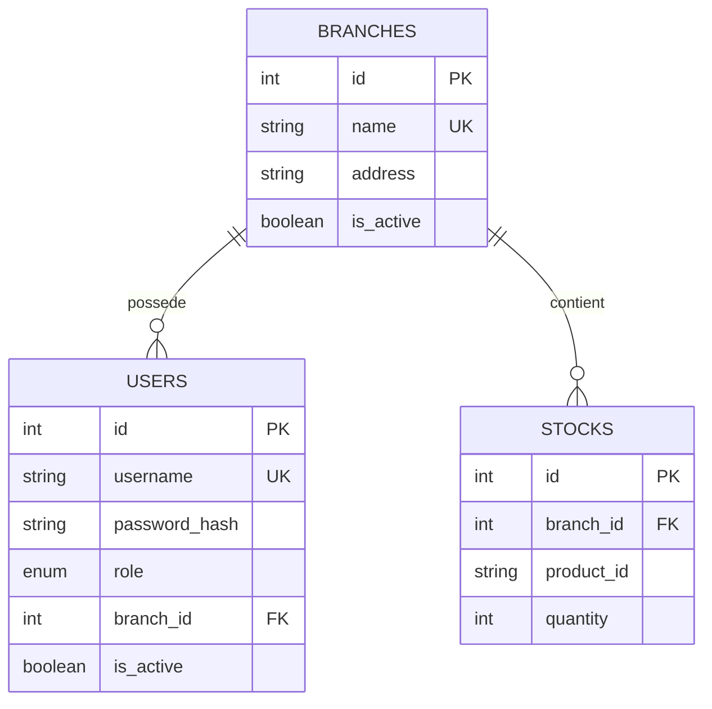

# HBntory - Diagramme de base de donnees

## Diagramme ERD



## Relations

```text
branches.id 1 ---- N users.branch_id
branches.id 1 ---- N stocks.branch_id
```

## Contraintes importantes

```text
branches.name est unique
users.username est unique
stocks.branch_id + stocks.product_id est unique
stocks.quantity doit etre >= 0
users.branch_id peut etre NULL si la branche est supprimee
stocks sont supprimes automatiquement si la branche est supprimee
```

## Explication courte

```text
La table branches represente les magasins physiques.
La table users represente les utilisateurs du systeme, avec un role admin ou common.
Un utilisateur common est rattache a une branche.
La table stocks represente les quantites disponibles pour chaque produit dans chaque branche.
Le produit lui-meme n'est pas stocke dans cette base : les details produit viennent de la Product API.
```

